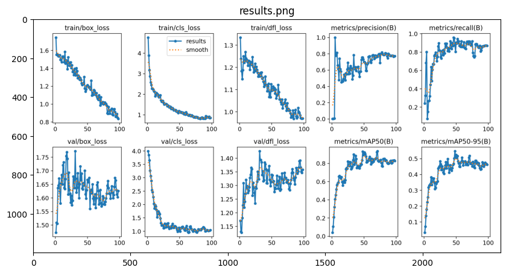
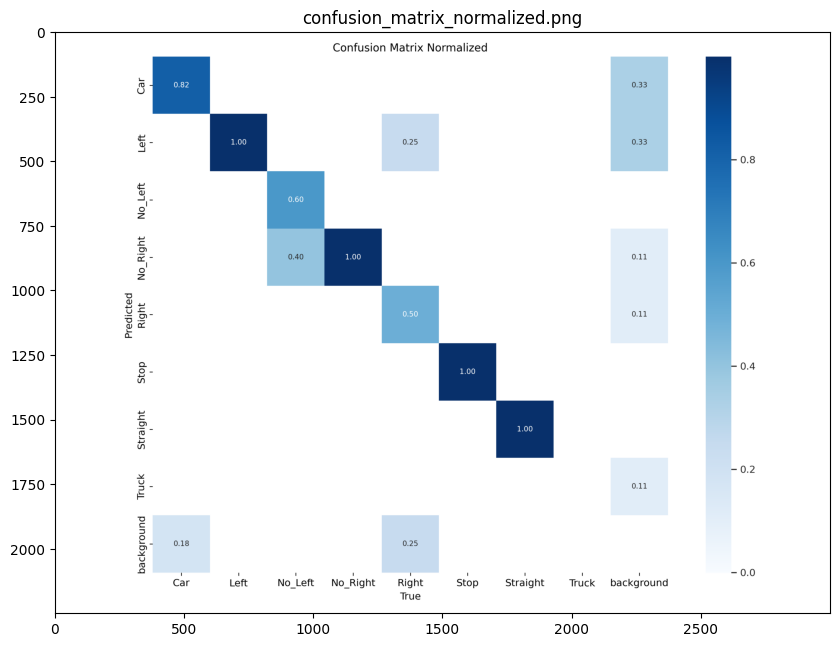
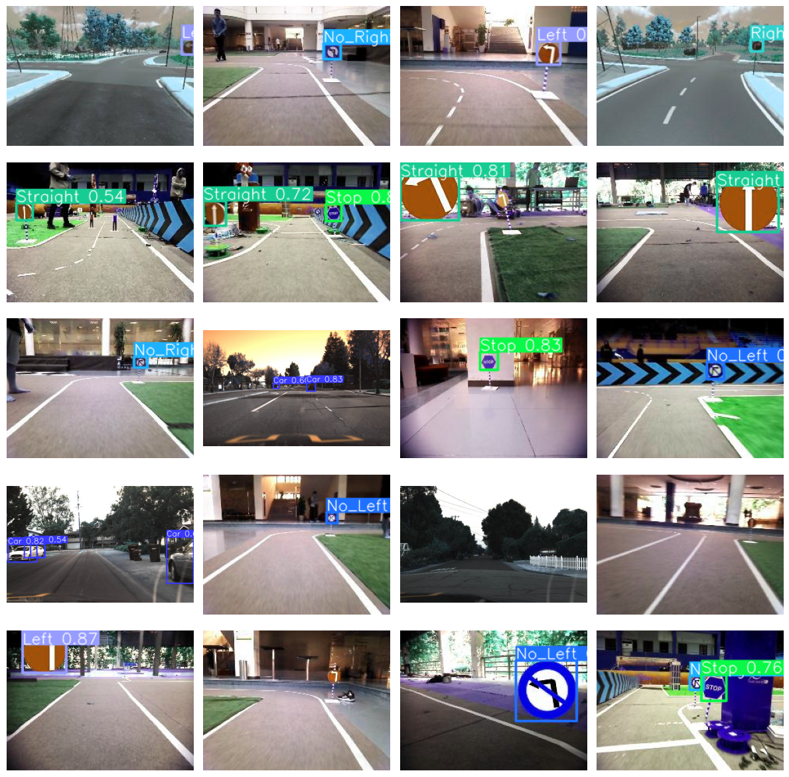
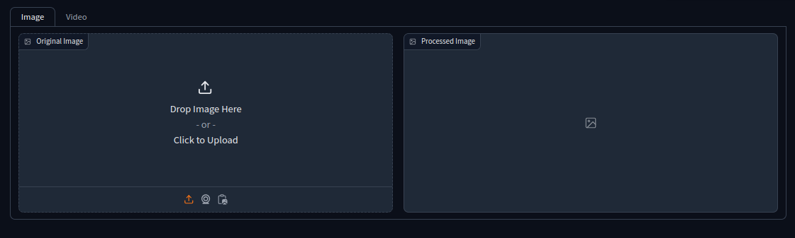

# Traffic Sign and Vehicle Detection Using YOLOv8

This project focuses on detecting traffic signs and vehicles using a YOLOv8 model, which has been fine-tuned on a custom dataset. The dataset includes various traffic signs and vehicle images, making the model adept at identifying and classifying these objects in real-world scenarios.

## Features

- **Traffic Sign and Vehicle Detection**: The model accurately identifies and classifies different types of traffic signs and vehicles.
- **Gradio Integration**: An interactive Gradio interface allows users to upload images and videos to see detection results in real-time.
- **Model Evaluation**: The model's performance is evaluated using metrics such as confusion matrix, loss, accuracy, and more.

## Model Training

The model was trained using the YOLOv8 framework on a custom dataset. The dataset was split into training, validation, and test sets. The training process involved 100 epochs with a batch size of 16 and an image size of 640x640.

## Training Metrics

- **Training Results**: The following image represents the training progress, including loss, accuracy, and other key metrics.

- **Confusion Matrix**: The confusion matrix below shows the performance of the model in terms of correctly and incorrectly classified instances.

## Test Results

### Images

The model was tested on several images from the test dataset. Below are some examples showing the detection results.

### Videos

The model was also tested on videos. Below are some side-by-side comparisons of the original video and the processed video with detection results.

| Original Video | Processed Video |
| -------------- | --------------- |
|  |  |

| Original Video | Processed Video |
| -------------- | --------------- |
|  |  |

## Dataset

The dataset used for training and evaluation is provided in the `/Dataset` folder. The dataset consists of images and corresponding labels divided into `train`, `val`, and `test` subsets.

## Gradio Interface

The Gradio interface allows users to upload images or videos and see the detection results in real-time. The interface is easy to use and provides a quick way to test the model on custom data.

